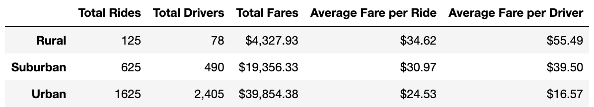
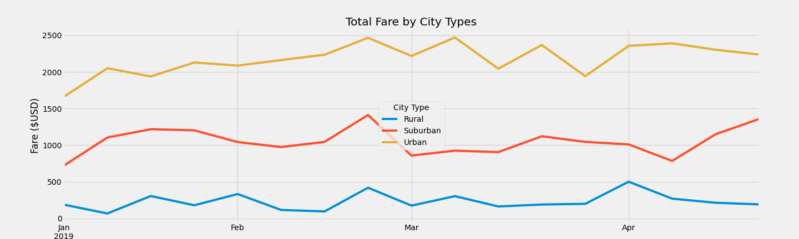

# PyBer_Analysis

## Project Overview
Perform an exploratary analysis for a ride sharing app, Pyber. Create serval types of visualization to tell a compelling story about the data. Writing Python scripts using Panda's library, Jupyter notebook, and Matplotlib to create variety of charts that showcase the relationship between the type of city, and the number of drivers and riders, as well as the percentage of the total fares, drivers and riders by type of city. The analysis and visualization will help Pyber improve access to ride-sharing services and determine addordablity for underserved neighborhoods.  

<a href = "https://github.com/angelnga/PyBer_Analysis/blob/main/PyBer.ipynb">  PyBer.ipynb </a>
- Create a bubble chart that showcases the average fare versus the total number of rides 
- Determine the mean, median, and mode 
- Create box-and-whisker plots to determine if there are any outliers
- Create a pie chart for each city type

<a href = "https://github.com/angelnga/PyBer_Analysis/blob/main/PyBer_Challenge.ipynb"> PyBer_Challenge.ipynb </a>
- Deliverable 1: A ride-sharing summary DataFrame by city type
- Deliverable 2: A multiple-line chart of total fares for each city type

## Pyber Analysis Results
### Summary Table - PyBer by City Type (Early 2019)

  1. Total Riders: Urban has the most riders compare to Suburban and Rural. It's 68.4% from total riders. 
  2. Total Drivers: Urban has the most drivers compare to other city. But it shows a unique relationship where Urban is the only city that has drivers more than riders. 
  3. Total Fares: 62.7% of the fares is generated by Urban, which is the highest. And followed by Suburban with 30.5% and Rual with 6.8%.
  4. Average Fare per Ride and per Driver: Rural has the highest fare in both result. There might be two possible reason:
     - Each ride is longer in Rural
     - Lack on driver leading in a higher fare.  
  This can be proof by looking at the ratio between total riders and drivers. Every drivers in Rural has to serve 1.6 riders, Surburban is 1.27 riders, and Urban is 0.67 riders.
  
### Weekly Fares by City Type (Early 2019)

All three cities remain constant in early 4 months of 2019. There are not much increase in revenue after March. Adjust might be needed for further improve. 

## Summary

Business recommendations to the CEO for addressing any disparities among the city types:
1. Increase drivers in Rual to fufill riders' need in order to lower the fare per ride due to supply and demand. Average rides become more affordable could help expanding the market.
2. Rual generate the highest average fare per ride, expand the market could bring in more profit. 
3. Drivers in Urban is more than riders. Increase marketing budget targeting urban riders could bring in higher profir and avg fare by drivers.

